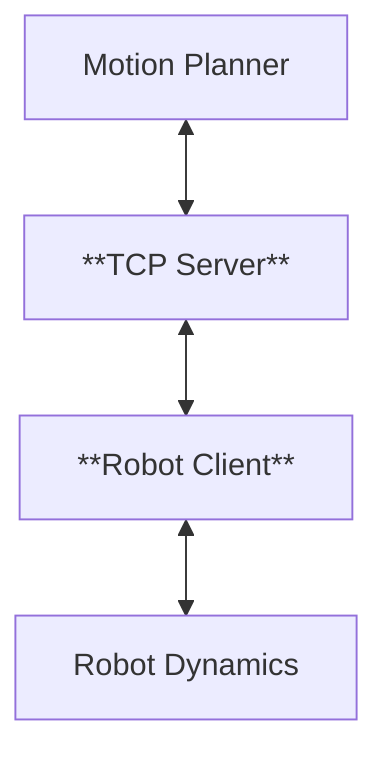

# Network Controlled Autonomous Mobile Robot
This project is about network-controlled autonomous mobile robot. The system consists of a motion planner, a TCP-based communication server, and a robot client that handles the robot's dynamics and execution. The motion planner computes optimal control (Steering and Speed Reference) and sends commands to the server, which then transmits them to the robot client over a TCP connection. The robot client executes these commands while managing real-time feedback and control. The Client internally call the PID control to get the acceleration and Steering speed which then fed into the robot's dyanmics.
# System Architecture Diagram



https://github.com/user-attachments/assets/31855e9c-6aaa-4744-acb6-ca8be0d7e39e


## Motion Model Reference
1. https://gitlab.lrz.de/tum-cps/commonroad-vehicle-models/-/blob/master/vehicleModels_commonRoad.pdf
2. https://github.com/f1tenth/f1tenth_gym

Implemented motion model are based on the single track model (bicycle model), model which considers the forces,friction, slips

#### Limitation
1. No roll/pitch dynamics:  Ignores body roll and pitch
2. Same slip angle per axle: Both wheels on the same axle are assumed to have same slip angle
3. Lumped Parameters: Mass, tire cornering stiffness, and other parameters for each axle are combined into single, equivalent values.


## External Dependency
1. Eigen3 (for Mathematical operations)
2. Sfml (for visualization)


## Steps to execute
```
./build.sh
cd build
./network_control_av
```

## Repository Structure
```
.
├── build.sh
├── client
│   ├── CMakeLists.txt
│   ├── include
│   │   └── client.hpp
│   └── src
│       └── client.cpp
├── CMakeLists.txt
├── main.cpp
├── maps
│   ├── Austin_centerline.csv
│   ├── e7_floor5_square.csv
│   └── Sakhir_centerline.csv
├── network_control_mr.tar.gz
├── pure_pursuit
│   ├── CMakeLists.txt
│   ├── include
│   │   └── pure_pursuit.hpp
│   └── src
│       └── pure_pursuit.cpp
├── README.md
├── repo-tree.txt
├── robot
│   ├── CMakeLists.txt
│   ├── include
│   │   ├── robot_abc.hpp
│   │   ├── robot_base.hpp
│   │   └── robot_factory.hpp
│   └── src
│       ├── robot_abc.cpp
│       └── robot_base.cpp
├── server
│   ├── CMakeLists.txt
│   ├── include
│   │   └── server.hpp
│   └── src
│       └── server.cpp
├── simulator
│   ├── CMakeLists.txt
│   ├── fonts
│   │   └── Arial_Bold.ttf
│   ├── include
│   │   └── simulator.hpp
│   └── src
│       └── simulator.cpp
└── video
    └── square_track.mp4

18 directories, 29 files
```