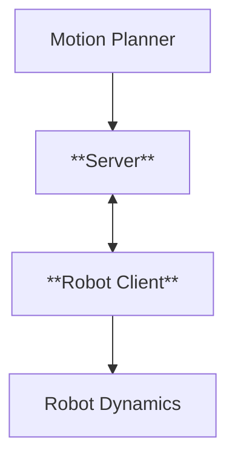

# Network Controlled Autonomous Mobile Robot
This project is about network-controlled autonomous mobile robot. The system consists of a motion planner, a TCP-based communication server, and a robot client that handles the robot's dynamics and execution. The motion planner computes optimal control (Steering and Speed Reference) and sends commands to the server, which then transmits them to the robot client over a TCP connection. The robot client executes these commands while managing real-time feedback and control. The Client internally call the PID control to get the acceleration and Steering speed which then fed into the robot's dyanmics.
# System Architecture Diagram

https://github.com/user-attachments/assets/31855e9c-6aaa-4744-acb6-ca8be0d7e39e

## External Dependency
    1. Eigen3 (for Mathematical operations)
    2. Sfml (for visualization)

