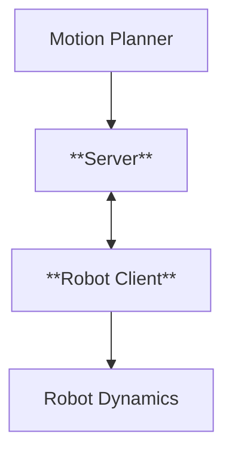

# Network Controlled Autonomous Mobile Robot

# System Architecture Diagram

https://github.com/user-attachments/assets/31855e9c-6aaa-4744-acb6-ca8be0d7e39e

## sfml dependency
apt-get install libsfml-dev
